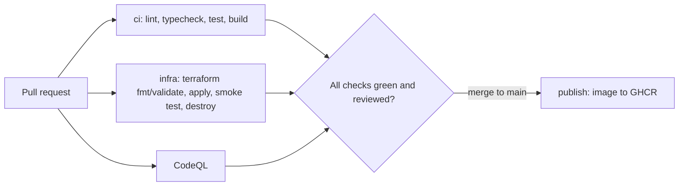

# Neighborhood Housing Tool

[](https://github.com/hosseinghzadeh/neighborhood-housing-tool/actions/workflows/ci.yml)
[](https://github.com/hosseinghzadeh/neighborhood-housing-tool/actions/workflows/codeql.yml)

A neighbourhood-matching housing tool. Describe your household, budget and
priorities in plain language, and it scores neighbourhoods on safety,
schools, education level, commute and affordability — showing which areas
fit your life, and why.

Built with:

- TanStack Start
- TypeScript
- React
- Tailwind CSS

## Run it

**Quickest, for development** (needs Node.js 22 and [bun](https://bun.sh)):

```sh
bun install
bun dev
```

Open <http://localhost:8080>.

**As a container, provisioned with Terraform** (needs Docker and Terraform; no cloud account):

```sh
cd infra
terraform init
terraform apply        # builds the image from the Dockerfile and starts the container
```

Open <http://localhost:8080>. Remove everything again with `terraform destroy`.

To run the image published by the pipeline instead of building it locally
(the package must be public):

```sh
terraform apply -var image=ghcr.io/hosseinghzadeh/neighborhood-housing-tool:latest
```

The free-text AI box works without any configuration (an offline parser is the
fallback); see "AI-assisted input" below to enable the AI-backed version.

## Quality gates

Every pull request runs, in GitHub Actions (`.github/workflows/ci.yml`):

| Check               | Command             |
| ------------------- | ------------------- |
| Lint                | `bun run lint`      |
| Type check          | `bun run typecheck` |
| Unit tests (Vitest) | `bun run test`      |
| Production build    | `bun run build`     |

CodeQL scans the code for vulnerabilities (`.github/workflows/codeql.yml`) and
Dependabot opens weekly update PRs (`.github/dependabot.yml`).
See [CONTRIBUTING.md](CONTRIBUTING.md) for the review workflow and
[docs/AI_USAGE.md](docs/AI_USAGE.md) for how AI tools were used.

## Pipeline



| Stage                    | What happens                                                                                                                                                        |
| ------------------------ | ------------------------------------------------------------------------------------------------------------------------------------------------------------------- |
| CI (`ci.yml`, `ci`)      | Lint, type check, unit tests and production build run in parallel on every PR.                                                                                      |
| IaC (`ci.yml`, `infra`)  | Terraform (`infra/`) is formatted and validated, then used to build the image from the `Dockerfile`, start the container, smoke-test it over HTTP and destroy it.   |
| Security                 | CodeQL scans on every PR and weekly; Dependabot opens weekly PRs for dependencies, GitHub Actions, base images and Terraform providers.                             |
| CD (`ci.yml`, `publish`) | After a merge to `main`, once all of the above passed, the image is pushed to `ghcr.io/hosseinghzadeh/neighborhood-housing-tool` as `latest` and as the commit SHA. |

## AI-assisted input (optional)

The natural-language request box (`src/lib/areafit-ai.functions.ts`) calls
an OpenAI-compatible chat-completions endpoint to turn free text into a
structured household profile. It is optional — without it, the rest of the
app (map, scoring, filters) still works, only the free-text box is disabled.

To enable it, set these environment variables to any OpenAI-compatible
provider (e.g. a free tier from your hosting provider, Groq, OpenRouter,
Cloudflare Workers AI, etc.):

```
AI_API_KEY=...
AI_API_BASE_URL=https://api.example.com/v1
AI_MODEL=some-model-name
```

## Notes

- `@lovable.dev/vite-tanstack-config` in `package.json` is a public build-tool
  dependency (it wraps TanStack Start's Vite config) — the project was
  originally scaffolded with [Lovable](https://lovable.dev), but no longer
  syncs with it and has no other Lovable-specific dependency or service call.
- Map and neighbourhood data (`src/data/`) is seeded demo data for the
  Stockholm region, not live statistics. There is no database: the data lives in
  code behind an `AreaRepository` interface (`src/data/providers/`), which is
  where a database-backed implementation would plug in.
- Terraform state is local (ephemeral in CI). There is no persistent hosting
  environment: the pipeline proves the system can be provisioned, run and
  verified from code, and publishes the artifact. Pointing the same Terraform at
  a remote Docker host would be the next step.
